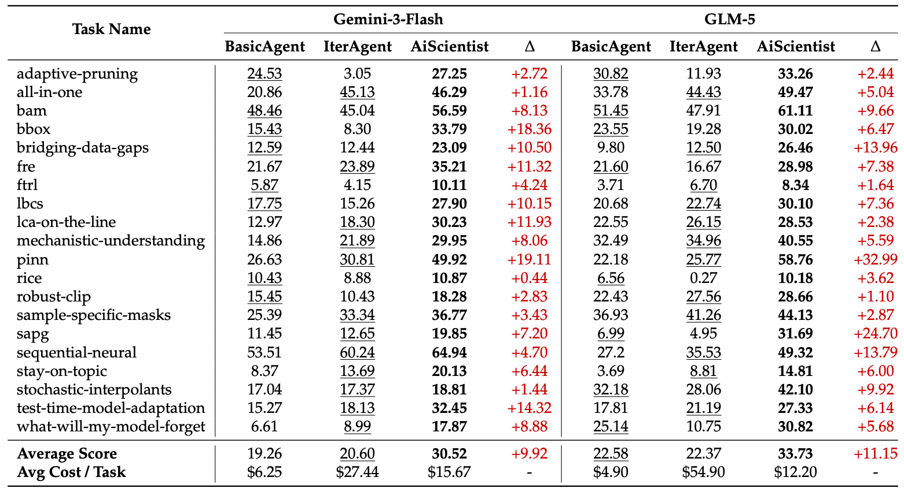
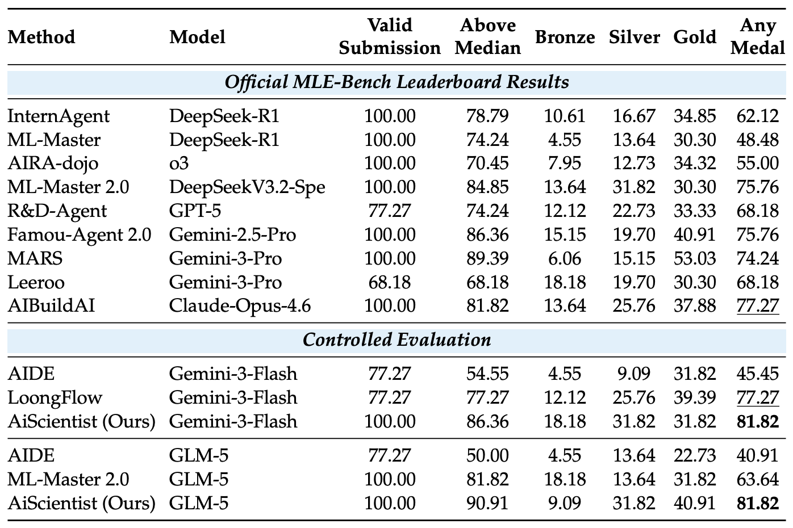

# AiScientist: A File-as-Bus Research Lab

**Long-horizon ML research needs File-as-Bus coordination, not just message handoffs.**  
***Talk is cheap**, show me **your files**.*  

> AiScientist is built for long-horizon ML research engineering, where agents must maintain coherent progress across heterogeneous stages while preserving evolving project state over time.

*Across a 24-hour autonomous run, AiScientist repeatedly implements, tests, keeps, and discards candidate ideas while pushing the running best upward. This trajectory shows long-horizon improvement through 78 experiment cycles, with diverse solution strategies explored along the way rather than a single lucky guess.*

## 📰 News

- `2026-04-17`: Released the paper on [arXiv](https://arxiv.org/pdf/2604.13018) and added benchmark integrations for `PaperBench` under `benchmark/frontier-evals` and `MLE-Bench` under `benchmark/MLE-bench`.
- `2026-04-13`: Initial public release of AiScientist, including the `File-as-Bus` runtime model, hierarchical research-team orchestration, and long-horizon `paper` / `mle` workflows.
- More updates will include benchmark extensions, ablations, release notes, and project milestones.

## 🔬 What AiScientist Is

AiScientist is an artifact-mediated virtual research lab for long-horizon ML research engineering. It treats long-horizon performance as a joint systems problem: agents must not only orchestrate the right expertise at the right stage, but also preserve evolving project state with enough fidelity for later decisions to stay coherent.

- `paper`: given a paper markdown or bundle plus a GPU and time budget, AiScientist autonomously drives the full reproduction loop from reading and planning to implementation, experimentation, debugging, and final self-check.
- `mle`: given an ML task plus a GPU and time budget, AiScientist autonomously conducts research for stronger solutions through repeated implementation-and-experiment cycles that improve the target metric over time.

File-as-Bus is the core coordination protocol. Instead of compressing progress into lossy conversational handoffs, AiScientist turns workspace files into the system of record for plans, code, experiments, logs, and validation artifacts.

---

<p align="center"><em>A short look at AiScientist in motion.</em></p>

<table align="center" width="82%">
<tr>
<td align="center">

https://github.com/user-attachments/assets/4356691b-eeb5-4766-a50b-29ddbc48ef9b

</td>
</tr>
</table>

---

## ✨ Why It Feels Different


|     |
| --- |
|     |


### Hierarchical Research Team

**A hierarchical research team pairs a top-level Orchestrator with specialists and focused subagents to sustain coherent progress over multi-day workloads.**

### File-as-Bus Coordination

**Agents coordinate through evolved workspace files instead of relying only on lossy message handoffs between prompts.**

### Workspace as System of Record

**A permission-scoped workspace and compact workspace map keep plans, code, experiments, and validation as the durable source of truth for both agents and operators.**

### Thin Control over Thick State

**The Orchestrator keeps control thin through stage-level directives, concise summaries, and a workspace map, while specialists progressively disclose thick state by reading task-relevant artifacts on demand.**

<<<<<<< HEAD
---

*A short look at AiScientist in motion.*


|     |
| --- |
|     |


[https://github.com/user-attachments/assets/4356691b-eeb5-4766-a50b-29ddbc48ef9b](https://github.com/user-attachments/assets/4356691b-eeb5-4766-a50b-29ddbc48ef9b)

---

=======
>>>>>>> github/main
## ⚙️ How It Works

1. **Stage the workspace.** AiScientist stages the inputs into a permission-scoped workspace and builds a compact `workspace map` that acts as the lightweight entry point into the run state.
2. **Launch the sandbox.** A Docker sandbox mounts the workspace into canonical paths under `/home`, giving agents an isolated execution environment with shared persistent state.
3. **Keep control thin.** The `Orchestrator` makes stage-level decisions and delegates heavy work to specialists through the `Agent-as-Tool` pattern.
4. **Keep state thick.** Specialists and focused subagents coordinate through `File-as-Bus` artifacts: they read task-relevant files on demand and write back plans, code, experiments, logs, and validation results.
5. **Leave an inspectable run behind.** The run finishes with a workspace, logs, artifacts, and export bundle that can be resumed, validated, diffed, or audited without reconstructing state from memory.

This is the core shift from message handoffs to `File-as-Bus` coordination: **control stays lightweight**, while **project state remains durable, readable, and reusable on disk**.

## 🧭 Two Tracks

AiScientist uses one control plane for two long-horizon workloads: paper reproduction and Kaggle-style MLE competitions.


| Track   | Primary entrypoints                                                                              | What the loop optimizes for                                                                                                                 | Validation endpoint                            |
| ------- | ------------------------------------------------------------------------------------------------ | ------------------------------------------------------------------------------------------------------------------------------------------- | ---------------------------------------------- |
| `paper` | `--paper-md`, `--zip`                                                                            | turn paper context into a runnable reproduction through reading, planning, implementation, experimentation, debugging, and final self-check | final self-check plus `validation_report.json` |
| `mle`   | exactly one of `--zip`, `--name`, `--workspace-zip`, `--competition-bundle-zip`, or `--data-dir` | search for stronger solutions through repeated implementation-and-experiment cycles that improve the target metric over time                | submission-format or grading validation        |


Both tracks share the same workspace model: durable files on disk become the common state that agents, operators, and validation flows can all inspect later.

### Paper Track

`paper` is the paper-grounded long-horizon ML research track. Starting from `--paper-md` or a bundled `--zip`, AiScientist carries work across paper understanding, task planning, implementation, experimentation, debugging, and final self-check under a fixed compute and time budget.

### MLE Track

`mle` is the competition-style long-horizon ML engineering track. Starting from the most self-contained `--zip` path or a prepared-cache `--name`, AiScientist iterates through implementation-and-experiment cycles to explore stronger solutions and continuously improve the target metric over time.

## 🏁 Benchmark Results

The `benchmark/` directory exists to support **rigorous, reproducible, and inspectable**
experiments rather than one-off demos. We keep benchmark integrations in-tree so
other researchers can:

- rerun the same systems under matched budgets and controlled settings
- inspect logs, artifacts, and workspaces instead of relying on anecdotal summaries
- compare orchestration designs on standardized long-horizon workloads
- extend the benchmark setup for follow-up research

Two benchmark integrations are currently included:

- [PaperBench integration](benchmark/frontier-evals/README.md)
- [MLE-Bench integration](benchmark/MLE-bench/README.md)

### PaperBench Results

On full `PaperBench`, AiScientist consistently outperforms the strongest baseline
within each model family under our controlled evaluation setup.

Notable observations:

- On average, AiScientist reaches `30.52` on Gemini-3-Flash and `33.73` on GLM-5, improving over the strongest baseline by `+9.92` and `+11.15`, respectively.
- AiScientist beats the best baseline on every task in both the Gemini-3-Flash and GLM-5 controlled comparisons.
- The gains are especially large on harder papers such as `pinn`, `bbox`, `bridging-data-gaps`, `sapg`, and `test-time-model-adaptation`.
- The improvement does not come from simply spending more than every baseline: on both model families, AiScientist substantially outperforms `IterAgent` while using much lower average cost per task.

For the full task-by-task breakdown, see the figure below.

<p align="center">
  
</p>

### MLE-Bench Lite Results

On `MLE-Bench Lite`, AiScientist also improves the end-to-end competition-style
workflow under matched model comparisons.

In our controlled evaluation:

- AiScientist reaches `81.82` Any Medal on both Gemini-3-Flash and GLM-5.
- On Gemini-3-Flash, it improves over the strongest baseline (`77.27` Any Medal).
- On GLM-5, it improves over the strongest baseline (`63.64` Any Medal) while also achieving the best `Above Median`, `Silver`, and `Gold` rates in the matched comparison.

The matched-comparison results table is shown below.

<p align="center">
  
</p>


Taken together, the PaperBench and MLE-Bench results support the same point:
AiScientist is not optimized for a single short interaction, but for **durable,
artifact-mediated progress over long-horizon research workloads**.

## 💾 What Lands On Disk

Each run leaves a concrete, inspectable tree under `jobs/<job_id>/`. The full job directory is the durable run record, but `workspace/` is the agent-visible `File-as-Bus`: it is where plans, code, experiments, and submissions persist as the primary system of record for ongoing coordination.

```text
jobs/<job_id>/
├── input/
├── workspace/                  # primary File-as-Bus / system of record
│   ├── paper/ or data/
│   ├── code/                    # mle
│   ├── submission/
│   │   ├── submission.csv
│   │   ├── submission_registry.jsonl
│   │   └── candidates/          # mle
│   └── agent/
│       ├── paper_analysis/ or analysis/
│       ├── prioritized_tasks.md
│       ├── plan.md
│       ├── impl_log.md
│       ├── exp_log.md
│       └── final_self_check.{md,json}   # paper
├── logs/                        # operator / trace layer
├── artifacts/                   # validation / champion reports
├── export/                      # packaged outputs
└── state/                       # host-side runtime metadata
```

The files inside `workspace/` are the bus:

- analysis becomes `workspace/agent/paper_analysis/*.md` for `paper` and `workspace/agent/analysis/summary.md` for `mle`
- planning becomes `workspace/agent/prioritized_tasks.md` and, when needed, `workspace/agent/plan.md`
- implementation and experiments become `workspace/agent/impl_log.md` and `workspace/agent/exp_log.md`
- MLE candidate search becomes `workspace/submission/submission.csv`, `workspace/submission/submission_registry.jsonl`, and `workspace/submission/candidates/`
- paper reproducibility becomes `workspace/agent/final_self_check.md`, `workspace/agent/final_self_check.json`, and `workspace/submission/reproduce.sh`

Outside the bus, the host still preserves `logs/`, `artifacts/`, and `state/` so the run can be inspected, resumed, validated, exported, and audited later.

## 🚀 Quick Start


|     |
| --- |
|     |


**Environment Note**  
The current Dockerfiles are still tuned for our operator environment. Both `[docker/paper-agent.Dockerfile](docker/paper-agent.Dockerfile)` and `[docker/mle-agent.Dockerfile](docker/mle-agent.Dockerfile)` reference internal Ubuntu images and package mirrors. If you are outside that environment, replace those base-image and mirror lines before the first build. See the full notes in the [Operator Guide](docs/operator-guide.md).

**Profile Note**  
The shipped LLM defaults are not symmetric: `paper=glm-5`, `mle=gpt-5.4` in `[config/llm_profiles.yaml](config/llm_profiles.yaml)`. If you only have `OPENAI_API_KEY`, run paper commands with `--llm-profile gpt-5.4` and use `AISCI_PAPER_DOCTOR_PROFILE=gpt-5.4` for `paper doctor`, or update the default profile locally.

The main README keeps only the shortest runnable happy path. For the full setup, GPU and Docker prerequisites, profile caveats, example scripts, and validation/resume flows, use the [Operator Guide](docs/operator-guide.md).

### 1. Configure the host

```bash
git clone https://github.com/AweAI-Team/AiScientist.git
cd AiScientist

cp .env.example .env
# Fill either OpenAI or Azure OpenAI credentials.
uv sync --dev
```

Host-side requirements:

- Python 3.12+
- Docker with a reachable daemon
- `uv`
- API credentials for at least one configured LLM backend
- Optional NVIDIA GPUs if you want GPU-bound runs, with NVIDIA Container Toolkit configured for Docker

### 2. Build the default runtime images

If you are not supplying your own runtime images, these are the intended local tags:

```bash
bash docker/build_paper_image.sh
bash docker/build_mle_image.sh
```

- `aisci-paper:latest`
- `aisci-mle:test`

### 3. Run the built-in health checks

```bash
AISCI_PAPER_DOCTOR_PROFILE=gpt-5.4 uv run aisci paper doctor
uv run aisci mle doctor
```

If you use the shipped Azure-backed `glm-5` paper profile, you can drop the `AISCI_PAPER_DOCTOR_PROFILE` override.

### 4. Launch one paper run

```bash
uv run aisci --env-file .env paper run \
  --paper-md /abs/path/to/paper.md \
  --image aisci-paper:latest \
  --llm-profile gpt-5.4 \
  --gpu-ids 0 \
  --time-limit 24h \
  --wait \
  --tui
```

### 5. Launch one MLE run

```bash
uv run aisci --env-file .env mle run \
  --zip /abs/path/to/competition.zip \
  --name <competition-slug> \
  --image aisci-mle:test \
  --llm-profile gpt-5.4 \
  --gpu-ids 0 \
  --time-limit 12h \
  --wait \
  --tui
```

## 🔍 Inspect, Resume, and Validate

Highest-signal inspection commands:

```bash
uv run aisci jobs list
uv run aisci jobs show <job_id>
uv run aisci logs tail <job_id> --kind conversation
uv run aisci artifacts ls <job_id>
uv run aisci export <job_id>
```

For validation, resume, lifecycle helpers, and detailed troubleshooting, see the [Operator Guide](docs/operator-guide.md).

## 🗺️ Repo Map

```text
config/                   shared LLM, image, and paper-subagent registries
docker/                   default paper and MLE runtime image recipes
scripts/                  example launch scripts
src/aisci_app/            CLI, job service, presentation, TUI
src/aisci_core/           job models, paths, store, exporter, runner
src/aisci_runtime_docker/ Docker session manager and image profile resolver
src/aisci_domain_paper/   paper-grounded long-horizon ML research engineering
src/aisci_domain_mle/     competition-style long-horizon ML engineering
tests/                    host-side regression tests
```

AiScientist is opinionated enough to run real work, but still transparent enough that you can inspect every file the lab leaves behind.

## ❤️ Acknowledgments

AiScientist builds on prior work in research automation, evaluation, and ML task environments, especially:

- [PaperBench](https://github.com/openai/frontier-evals/tree/main/project/paperbench)
- [MLE-bench](https://github.com/openai/mle-bench)

We are grateful to the authors and maintainers of these projects for making this line of work more concrete, reproducible, and comparable.

## 📄 License

Released under the MIT License. See [LICENSE](LICENSE).

## 📬 Contact

For questions, collaboration, or bug reports, please open an issue or email 📧 `gx.chen.chn@gmail.com`.

#### *If AiScientist is useful in your research or engineering workflow, consider starring 🌟 the repo and citing the project.*

**[Quick Start](#quick-start) · [Two Tracks](#two-tracks) · Operator Guide**
